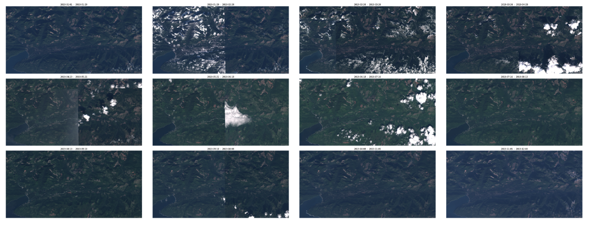
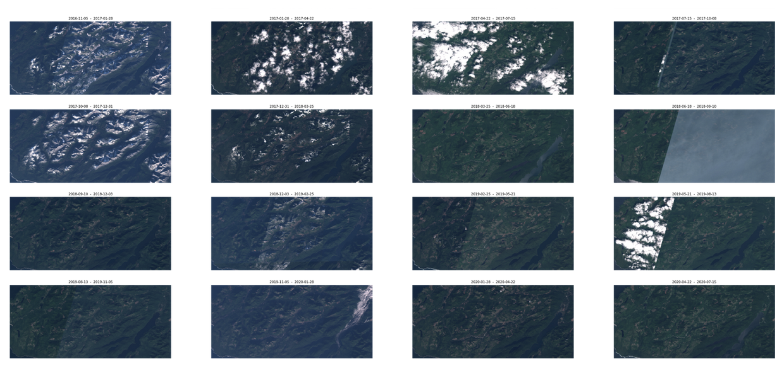
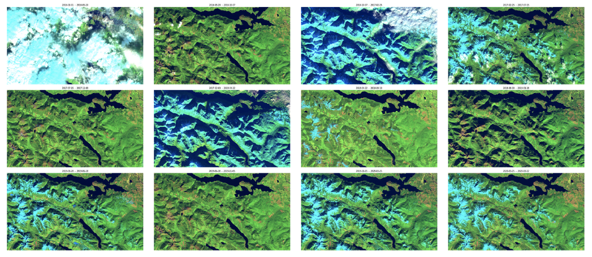
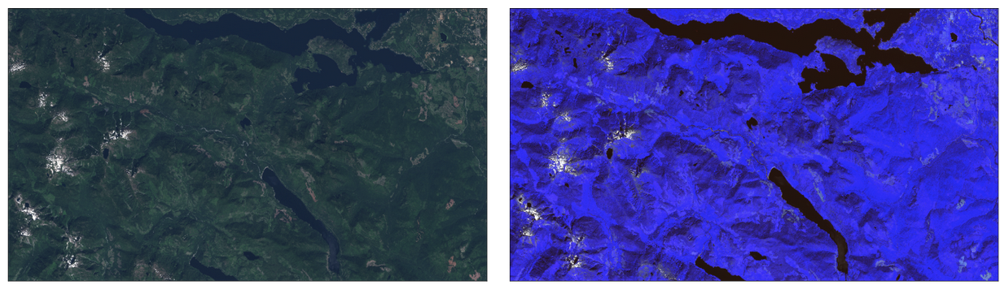

​

Just over 13 million hectares of old growth forest remains today in BC and make up around 23% of all forested areas in the province. Our project will go in one of two possible directions: studying old growth forests in BC and modelling and predicting their decay; or, investigating the sustainability and environmental effects of overfishing and fish farming in coastal BC.

British Columbia’s old growth forests are a collapsing ecosystem with historical and current significance to the Indigenous Peoples of the region. Despite old growth forests pulling carbon from the atmosphere at a slower rate than young forests, their carbon stores are immense. When older forests are logged, much of this carbon is released into the atmosphere.

​
# Blog Post Update 
​
Climate change is an issue that is both very real and very dangerous. For more than 20 years scientists have been warning of the dangers of our increased carbon emissions, but governments are still not taking action. Canada is in the top ten countries for GHG emissions per capita, with our government failing every single climate goal it has promised to meet over the past 20 years. The most recent example of this government failure is the logging of old growth in Fairy Creek.
 
With our emissions still not in decline, carbon sinks (sources of carbon sequestration) are vital to our continued existence on earth. One of the most important carbon sinks we have is right here in B.C. Old growth forests pull carbon dioxide from the atmosphere and “the sequestered carbon dioxide is stored in live woody tissues and slowly decomposing organic matter in litter and soil” [1]. Not only does old growth logging releases the stored carbon, but it also removes invaluable carbon sequestration resources when we are in the greatest need of carbon sinks.
 
The goal of our project is to bring light to the importance of old growth forests as a resource for combating climate change. We plan to do this by creating metrics and indicators that clearly illustrate the effects old growth forests have on carbon emissions.

​
## Test Sites 

### Fairy Creek 
Fairy Creek, located northeast of Port Renfrew on Pacheedaht territory, is one of the last unlogged old growth forests on southern Vancouver Island. Even though the small area known as Fairy Creek is currently unlogged, the surrounding forests have been heavily clearcut

### Klanawa Valley 
The Klanawa Valley, located on southern Vancouver Island, was an old growth forest that has been previously logged. We hoped to gather and examine the data of already-logged sites such as this to help determine the carbon emission impact that is left behind once the forest has been destroyed. 

### Nahmint Valley
The Nahmint Valley is another previously-logged area of southern Vancouver Island, near the town of Port Alberni. It is home to many species that can only survive in ancient forests, making it a critical area for our study. 

## Data Collection 

The Vegetation Resource Inventory (VRI) 

| VRI Data name      | Data Description  |
| :-----             | :---| 
| Tree Species       | A list of the minor and major tree species in a given layer ordered by percentage | 
| Tree Cover Pattern | A numeric code that identifies the spatial distribution of the tree layer  | 
| Forest Cover Age Class | The age class projected to the current year for a given species based on area  | 
| Land Cover           | Identities a type of land cover  | 
| Disturbance History  | Describe how an area became this way, we can use it to determine if this area has been logged and what percentage of this area has been logged  | 

​

## Old Growth Carbon Emissions Calculator  

We are generating an overall carbon emission report that is calculated using Sentienel-2 and VRI data.To calculate our carbon emissions report for a given test site we first need to calculate how much carbon a certain species of tree (ST) can capture in their lifetime. Afterwards, we need to determine the average age of that tree species (AT), the percentage that this given species of tree occupies (PT). All this information is provided to us from the VRI dataset. From here determine all the other tree species (TS) and the overall area. 

(PT x ST x AT) x TS x Area 

ST =  Species of tree
AT =  Average age of tree species
PT = Percentage tree species occupies
TS =  All other tree species

